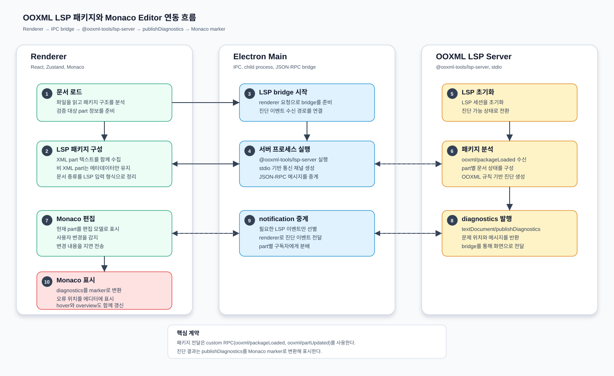

# OOXML LSP 패키지와 Monaco Editor 연동 흐름

이 문서는 현재 데스크톱 앱에서 `@ooxml-tools/lsp-server`를 어떻게 실행하고, OOXML 패키지 정보를 어떻게 전달하며, LSP diagnostics를 Monaco Editor에 어떻게 표시하는지 정리한다.



## 요약

현재 구조에서 `packages/ooxml-lsp`는 루트 워크스페이스에 직접 포함되는 패키지가 아니라, 하위 `packages/ooxml-lsp/packages/*`를 워크스페이스 패키지로 연결하는 외부 LSP submodule 영역이다. `packages/desktop`은 그중 `@ooxml-tools/lsp-server`를 의존성으로 받고, Electron main process에서 해당 서버의 `dist/bin.js`를 자식 프로세스로 실행한다.

Monaco Editor는 LSP 서버와 직접 통신하지 않는다. renderer의 `lspClient`가 preload IPC를 통해 main process의 `LspBridge`에 요청을 보내고, `LspBridge`가 stdio 기반 JSON-RPC로 LSP 서버와 통신한다. LSP 서버가 `textDocument/publishDiagnostics`를 보내면 main process가 다시 renderer로 중계하고, `XmlEditor`가 이를 Monaco marker와 decoration으로 변환해 표시한다.

## 패키지 역할

### `packages/ooxml-lsp`

- Git submodule로 관리되는 OOXML LSP 도구 모음 영역이다.
- 루트 `pnpm-workspace.yaml`은 `packages/ooxml-lsp` 자체는 제외하고, `packages/ooxml-lsp/packages/*`만 워크스페이스 패키지로 포함한다.
- `pnpm-lock.yaml` 기준으로 주요 하위 패키지는 `lsp-server`, `ooxml-core`, `ms-validator`, `ms-validator-bin`, `docx-engine`, `pptx-engine`, `sdk`, `test-fixtures`다.
- `@ooxml-tools/lsp-server`는 `vscode-languageserver`, `vscode-languageserver-textdocument`, OOXML 공통 코어, MS validator 계열 패키지를 사용해 diagnostics를 생성하는 서버 역할을 맡는다.

현재 작업 트리에서는 `packages/ooxml-lsp` 내용이 체크아웃되어 있지 않다. 그래서 이 문서는 desktop 쪽 연동 코드와 lockfile에 드러난 계약을 기준으로 현재 앱 관점의 흐름을 설명한다.

### `packages/desktop/src/main/lsp`

`server.ts`는 LSP 서버 실행 파일을 `@ooxml-tools/lsp-server/dist/bin.js`로 resolve하고, Electron의 `process.execPath`로 `--stdio` 서버를 실행한다.

실행 옵션은 다음 LSP 서버 인자로 변환된다.

- `enableMsValidator: false` → `--no-ms-validator`
- `msValidatorBinPath` → `--ms-validator-bin`
- `deepValidate` → `--deep-validate`
- `fileFormatVersion` → `--ms-validator-version`

`bridge.ts`는 main process의 LSP 통신 허브다.

- LSP 서버 프로세스를 시작하고 종료한다.
- `vscode-jsonrpc/node`의 `StreamMessageReader`, `StreamMessageWriter`로 stdio JSON-RPC 연결을 만든다.
- renderer에서 온 `lsp:request`, `lsp:notify` IPC를 LSP request/notification으로 전달한다.
- LSP 서버의 `textDocument/publishDiagnostics`, `window/showMessage`, `window/logMessage`, `telemetry/event` notification을 renderer에 `lsp:notification`으로 broadcast한다.
- `.omc/logs/lsp-debug.log`에 bridge, renderer, LSP stderr 로그를 남긴다.

### `packages/desktop/src/preload`

preload는 renderer가 직접 Node/Electron API에 접근하지 않도록 `window.electronAPI.lsp`만 노출한다.

- `start(options)` → `ipcRenderer.invoke('lsp:start', options)`
- `stop()` → `ipcRenderer.invoke('lsp:stop')`
- `request(method, params)` → `ipcRenderer.invoke('lsp:request', method, params)`
- `notify(method, params)` → `ipcRenderer.invoke('lsp:notify', method, params)`
- `onNotification(callback)` → main process가 보낸 `lsp:notification` 구독
- `log(message)` → renderer 쪽 LSP 로그를 main log file에 기록

### `packages/desktop/src/renderer/lsp`

`client.ts`는 renderer에서 사용하는 얇은 LSP client다. 표준 LSP client 라이브러리를 쓰기보다는, desktop 앱에 필요한 최소 계약만 감싼다.

- `ensureStarted()`가 LSP 서버를 시작하고 `initialize`, `initialized`를 보낸다.
- `loadPackage()`가 현재 OOXML 패키지를 `ooxml/packageLoaded` request로 서버에 전달한다.
- `schedulePartUpdate()`가 편집 중인 part 텍스트 변경을 200ms debounce한다.
- `updatePart()`가 `ooxml/partUpdated` request로 최신 part 텍스트를 보낸다.
- `virtualUriFor()`가 `ooxml-${kind}:/${base64url(packageId)}/${partPath}` 형태의 URI를 만든다.
- `onDiagnostics()`가 URI별 diagnostics listener를 등록하고, 마지막 diagnostics를 캐시한다.

`markers.ts`는 LSP diagnostics를 Monaco marker로 변환한다. LSP range는 0-based이고 Monaco marker는 1-based이므로 line/character에 각각 1을 더한다.

## 문서 로드 흐름

1. 사용자가 OOXML 파일을 열면 document store의 `loadDocument()`가 파일을 읽고 `parseDocument()`로 패키지 구조를 분석한다.
2. `loadCurrentDocumentToLsp()`가 `documentType`을 `xlsx`, `docx`, `pptx` 중 하나로 매핑한다.
3. 패키지의 모든 part를 순회한다.
4. XML part 또는 `.rels` part는 `getPart()`로 실제 텍스트를 읽어 descriptor에 포함한다.
5. 이미지 같은 비 XML part는 `text` 없이 `path`, `contentType`만 포함한다. 이는 content type에는 존재하지만 zip에 실물 part가 없다고 판단되는 상황에서 MS validator가 패키지 전체를 거부하지 않게 하기 위한 방어다.
6. `lspClient.loadPackage()`가 LSP 서버 시작을 보장한 뒤 `ooxml/packageLoaded` request로 패키지 전체 descriptor를 보낸다.
7. LSP 서버는 part 목록과 텍스트를 내부 문서 모델에 적재하고 diagnostics를 계산한다.

## Monaco Editor 표시 흐름

`XmlEditor`는 일반 편집 모드에서만 LSP diagnostics를 적용한다. 비교 모드에서는 diff editor를 사용하므로 LSP marker 적용을 건너뛴다.

1. `XmlEditor`가 `monaco-editor`를 동적 import하고 XML model을 만든다.
2. `lspClient.virtualUriFor(partPath)`로 현재 part의 LSP URI를 계산한다.
3. `lspClient.onDiagnostics(uri, listener)`로 해당 URI의 diagnostics를 구독한다.
4. diagnostics가 도착하면 `diagnosticsToMarkers()`로 Monaco marker 데이터로 변환한다.
5. `monaco.editor.setModelMarkers(model, 'ooxml-lsp', markers)`로 Problems/hover 기반 marker를 등록한다.
6. 동시에 `createDecorationsCollection()`으로 inline class, glyph margin class, overview ruler 표시를 적용한다.
7. effect cleanup 시 diagnostics listener, decorations, model markers를 정리한다.

## 편집 변경 흐름

1. 사용자가 Monaco Editor에서 XML을 수정한다.
2. `onDidChangeModelContent()`가 최신 텍스트를 읽고 `XmlEditor`의 `onChange()`를 호출한다.
3. document store의 `updatePartContent()`가 `modifiedContent`를 갱신한다.
4. 선택된 part가 있으면 `lspClient.schedulePartUpdate(selectedPart, content)`를 호출한다.
5. 200ms 동안 추가 변경이 없으면 `ooxml/partUpdated` request가 LSP 서버로 전송된다.
6. LSP 서버는 해당 part 기준으로 diagnostics를 다시 계산한다.
7. `textDocument/publishDiagnostics`가 main bridge를 거쳐 renderer로 돌아온다.
8. `XmlEditor`가 같은 URI의 marker와 decoration을 갱신한다.

## 통신 계약

현재 desktop과 LSP server 사이에는 표준 LSP와 custom OOXML RPC가 함께 쓰인다.

| 방향 | 메서드 | 용도 |
| --- | --- | --- |
| renderer → main → LSP | `initialize` | LSP 서버 초기화 |
| renderer → main → LSP | `initialized` | 초기화 완료 알림 |
| renderer → main → LSP | `ooxml/packageLoaded` | OOXML 패키지 전체 part descriptor 전달 |
| renderer → main → LSP | `ooxml/partUpdated` | 편집 중인 part의 최신 텍스트 전달 |
| LSP → main → renderer | `textDocument/publishDiagnostics` | Monaco에 표시할 diagnostics 전달 |
| LSP → main → renderer | `window/showMessage` | 서버 메시지 중계 |
| LSP → main → renderer | `window/logMessage` | 서버 로그 중계 |
| LSP → main → renderer | `telemetry/event` | 서버 telemetry 중계 |

## URI 규칙

renderer는 part별 diagnostics 구독을 위해 다음 virtual URI를 만든다.

```text
ooxml-${kind}:/${base64url(packageId)}/${partPath}
```

예시는 다음과 같다.

```text
ooxml-xlsx:/ZmlsZTovLy9DOi9kb2NzL2Jvb2sueGxzeA/xl/worksheets/sheet1.xml
```

여기서 `kind`는 `xlsx`, `docx`, `pptx` 중 하나이고, `packageId`는 현재 코드에서 `file://${filePath}` 형태다. `partPath`는 앞의 `/`를 제거해 정규화한다.

## 주의할 점

- LSP diagnostics range는 LSP 서버에 전달한 텍스트 기준이어야 한다. Monaco 화면에서 보여주는 formatted text와 LSP 서버의 part text가 다르면 marker 위치가 어긋날 수 있다.
- `packages/ooxml-lsp` submodule이 체크아웃되지 않으면 `@ooxml-tools/lsp-server/dist/bin.js`를 resolve할 수 없어 desktop LSP 시작이 실패한다.
- 현재 renderer client는 `shutdown`, `exit`를 명시적으로 호출하지 않고 bridge의 `stop()`에서 connection dispose와 child kill을 수행한다.
- `loadPackage()`는 diagnostics 캐시를 비우지만 `reset()`은 document store reset과 별도로 호출되어야 한다.
- 비교 모드에서는 LSP diagnostics 표시가 비활성화된다.
